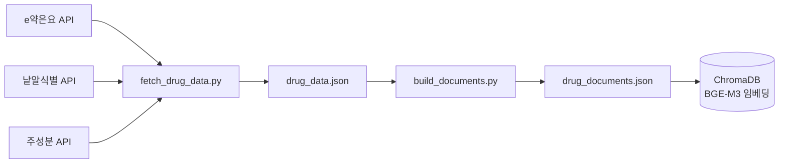
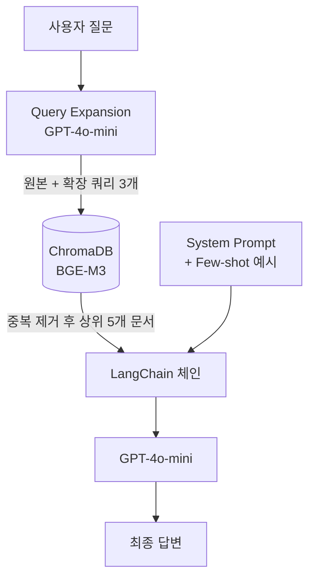

# 의약품 RAG QnA 시스템 개발 흐름

> Team RaGoon | 캡스톤 프로젝트

---

## 시스템 구조도

### 데이터 파이프라인



### QnA 파이프라인



---

## 1단계: 데이터 수집 (`fetch_drug_data.py`)

공공데이터포털 API 3개를 연동해서 의약품 원시 데이터를 수집.

| API                             | 제공 정보                                 |
| ------------------------------- | ----------------------------------------- |
| e약은요 API                     | 효능, 용법, 주의사항, 부작용 등 기본 정보 |
| 낱알식별 API                    | 제형, 모양, 색상                          |
| 의약품 제품 주성분 상세정보 API | 정확한 성분명 (`MTRAL_NM`)                |

**수집 과정에서 발생한 문제 및 해결:**

- 낱알식별 API 에서 알약 제형의 의약품 데이터만 제공 → 의약품명에서 제형 추출
- 테라플루 건조시럽이 "시럽"으로 오분류 → `extract_form_from_name()` 키워드 순서 수정
- 네트워크 오류 발생 시 db에 저장x → `safe_get()` 재시도 로직(3회) 추가

---

## 2단계: 문서 변환 (`build_documents.py`)

API 원시 데이터를 LLM이 읽기 좋은 설명서 형식으로 변환 → `drug_documents.json` 저장.

```
[타이레놀정 500밀리그램 설명서]

1.효능·효과
2.용법·용량
3.주의사항
4.부작용
5.성분
6.제형(외형)
```

- `ingredient_api` 필드를 우선 사용해 성분 정확도 개선
- "월경곤란증" → "월경곤란증(생리통, 월경통)" 동의어 보완 (검색 유사도 향상)

---

## 3단계: 임베딩 & 벡터 DB

- **BGE-M3** 모델로 문서 임베딩
- **ChromaDB PersistentClient**로 벡터 저장 (최초 1회만 임베딩, 이후 디스크에서 로드)
- LLM 없이 검색만 하는 버전으로 검색 품질 먼저 검증 후 LLM 연동 진행함

---

## 4단계: LLM 연동 (`rag_qna_multi.py`)

- **GPT-4o-mini** + **LangChain LCEL** 패턴으로 RAG 체인 구성
- `.env` 파일로 API 키 관리
- `prompts/system_prompt.py` 분리해서 프롬프트 관리

```python
chain = prompt | llm | StrOutputParser()
```

---

## 5단계: 프롬프트 설계 & 반복 개선 (`prompts/system_prompt.py`)

시나리오 테스트를 돌리면서 발견된 문제들을 프롬프트 규칙으로 해결.

| 발견된 문제                       | 해결 방법                                         |
| --------------------------------- | ------------------------------------------------- |
| 임산부에게 이부프로펜 추천        | 이부프로펜 계열 임산부 금지 명시                  |
| 생리통에 타이레놀 추천            | 월경통 → 이부프로펜 우선 규칙 추가 (출처: 하이닥) |
| 성인 요청에 어린이부루펜시럽 추천 | 대상 명시 시 이름 필터 규칙 추가                  |
| 소염제 요청에 타이레놀 추천       | 소염제/근육통 → 이부프로펜 규칙 추가              |

**한계:** 룰 기반 프롬프트 엔지니어링은 못 본 케이스에서 틀릴 수 있음.
향후 개선 방향으로 메타데이터 필터링(`has_anti_inflammatory`, `target_age` 등) 고려 가능.

---

## 6단계: Query Expansion

단순 키워드 검색의 한계를 극복하기 위해 LLM으로 쿼리를 자동 확장.

**문제:** "생리통"으로 검색하면 문서의 "월경곤란증"과 매칭 안 됨  
**해결:** LLM이 원본 쿼리 → 2개 추가 표현 생성 → 3개 쿼리로 검색 → 중복 제거 후 상위 5개 반환

```
"생리통이 심해요"
  → "월경통으로 인한 통증이 심한데 소염진통제 추천해주세요"
  → "생리 시 통증 완화를 위한 진통제를 알려주세요"
```

프롬프트에 동의어 목록을 하드코딩하는 방식을 제거하고 Query Expansion으로 대체.

---

## 7단계: Few-shot 예시 적용

프롬프트에 `FEW_SHOT_EXAMPLES`로 Human/AI 메시지 쌍으로 주입.

```
[system]  규칙
[human]   임산부 두통 질문  →  [ai] 타이레놀 추천   ← 예시
[human]   근육통 소염제 질문  →  [ai] 부루펜 추천   ← 예시
[human]   생리통 질문  →  [ai] 부루펜 추천          ← 예시
[human]   실제 사용자 질문
```

LLM이 답변 패턴을 미리 보고 추론하므로 일관성이 높아짐.

**문제 및 수정:**
- Few-shot 예시에 DB에 없는 약품(애드빌정, 겔포스, 개비스콘) 포함 → 할루시네이션 유발
- 해당 약품 제거 및 DB 내 약품으로만 교체 (애드빌 → 이지엔6이브연질캡슐)

---

## 8단계: 역질문(Reverse Questioning) 구현

약 추천 전에 필요한 정보(나이, 임산부 여부, 복용 중인 약)를 **한 번에 하나씩** 순서대로 수집하는 흐름 구현.

**설계 과정:**
- A안: 한 번에 여러 질문 → "ㅇㅇ/ㄴㄴ"처럼 모호한 답변 시 LLM이 잘못 매핑 (폐기)
- B안: 순차 질문(채택) → 질문 하나씩, 답변 받으면 다음 질문

**증상별 질문 순서 (프롬프트 9번 규칙):**
| 증상 | 질문 순서 |
|------|-----------|
| 진통제·해열제 | 나이 → 임산부 여부 → 현재 해열진통제·감기약 복용 여부 |
| 알레르기·두드러기 | 나이 → 임산부 여부 |
| 소화제·제산제 | 나이 → 임산부 여부 → 소화불량·속쓰림·설사 중 어떤 증상인지 |

**예외 (역질문 없이 바로 답변):**
- 특정 약 복용 가능 여부 문의 (예: "게보린 먹어도 되나요?")
- 두 약 비교 질문

Few-shot 예시도 순차 질문 흐름으로 추가:
```
[human] 머리가 너무 아파요. 약 추천해주세요.
[ai]    나이가 어떻게 되세요?
[human] 26살이요.
[ai]    임산부이신가요?
[human] 아니요.
[ai]    현재 다른 해열진통제나 감기약을 복용 중이신가요?
[human] 없어요.
[ai]    💊 추천 약: 이지엔6이브연질캡슐 ...
```

---

## 9단계: 검색 스킵 로직 (INFO_QUESTION_PATTERNS)

역질문에 대한 사용자의 답변은 ChromaDB 검색이 필요 없음.  
단, 소화제 증상 확인 질문(소화불량인가요? 등)에 대한 답변은 검색 필요.

**문제:** "요?"로 끝나는 모든 AI 질문에 검색 스킵 적용 시, 증상 확인 답변도 스킵 → 장엔폴 등 문서 미검색 → "OTC 없음" 오답 발생

**해결:** 정보 수집 질문 패턴(`INFO_QUESTION_PATTERNS`)으로 구분

```python
INFO_QUESTION_PATTERNS = ["나이가", "임산부", "임신 중", "복용 중이"]

def is_followup_response(chat_history: list) -> bool:
    """직전 AI 메시지가 정보 수집 역질문이면 True → 검색 스킵
    증상 확인 질문(소화불량인가요? 등)은 False → 검색 실행
    """
    if not chat_history:
        return False
    last_ai = chat_history[-1].content.strip()
    if not last_ai.endswith("요?"):
        return False
    return any(kw in last_ai for kw in INFO_QUESTION_PATTERNS)
```

| AI 직전 질문 | 패턴 매칭 | 검색 여부 |
|---|---|---|
| "나이가 어떻게 되세요?" | ✅ | 스킵 |
| "임산부이신가요?" | ✅ | 스킵 |
| "소화불량이신가요, 속쓰림이신가요?" | ❌ | 검색 실행 |

---

## 10단계: 음주 후 복용 규칙 추가

교수님 피드백 반영: 음주 후 두 계열 진통제 모두 금기.

**프롬프트 4번 규칙 추가:**
```
음주 후 진통제를 요청하는 경우 어떤 계열도 추천하지 마세요.
- 아세트아미노펜(타이레놀) + 음주 → 간손상 위험
- 이부프로펜(부루펜, 이지엔6이브) + 음주 → 위장출혈 위험
대신 충분한 수분 섭취와 휴식을 권장하고, 증상이 심하면 병원 방문을 안내하세요.
```

---

## 최종 시나리오 테스트 결과 (진통제 7 + 알러지 5)

| # | 시나리오 | 기대 | 결과 |
|---|----------|------|------|
| 1 | 성인 두통 | 역질문 → 이부프로펜 계열 추천 | ✅ |
| 2 | 임산부 두통 | 역질문 → 타이레놀 추천 | ✅ |
| 3 | 생리통 | 역질문 → 이부프로펜 계열 추천 | ✅ |
| 4 | 게보린 복용 가능 여부 (성인) | 역질문 없이 → 복용 가능 안내 | ✅ |
| 5 | 게보린 복용 가능 여부 (임산부) | 역질문 없이 → 금기, 타이레놀 대안 | ✅ |
| 6 | 음주 후 두통 | 역질문 → 어떤 진통제도 추천 안 함 | ✅ |
| 7 | 14살 두통 | 역질문 → 게보린 금기, 타이레놀 추천 | ✅ |
| 8 | 성인 두드러기 | 역질문 → 지르텍/클리어딘 추천 | ✅ |
| 9 | 임산부 두드러기 | 역질문 → 의사/약사 상담 권장 | ✅ |
| 10 | 5살 두드러기 | 역질문 → 소아과 진료 안내 | ✅ |
| 11 | 지르텍 vs 클리어딘 비교 | 역질문 없이 → 성분·특성 비교 후 추천 | ✅ |
| 12 | 임산부 지르텍 복용 가능 여부 | 역질문 없이 → 안전성 미확립, 상담 권장 | ✅ |

---
