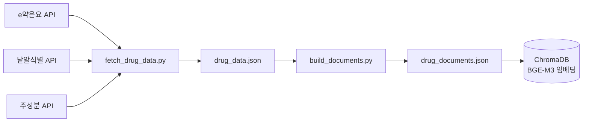
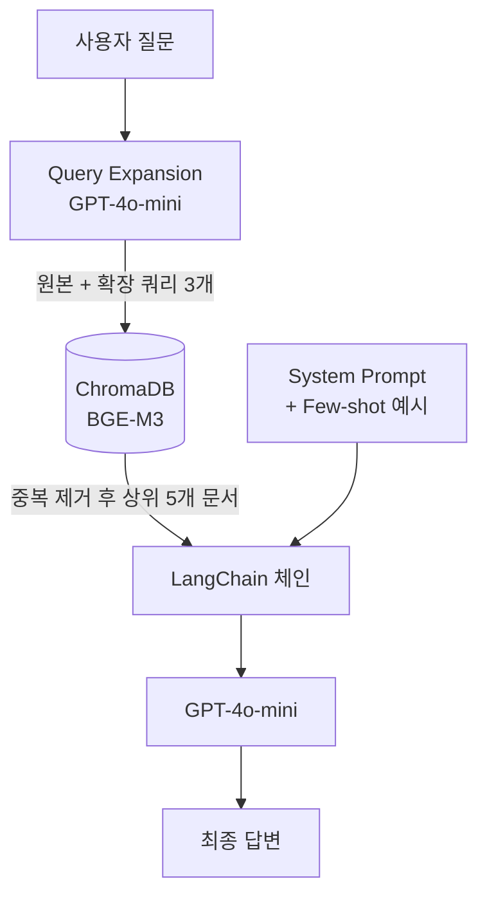

# 의약품 RAG QnA 시스템 개발 흐름

> Team RaGoon | 캡스톤 프로젝트

---

## 시스템 구조도

### 데이터 파이프라인



### QnA 파이프라인



---

## 1단계: 데이터 수집 (`fetch_drug_data.py`)

공공데이터포털 API 3개를 연동해서 의약품 원시 데이터를 수집.

| API                             | 제공 정보                                 |
| ------------------------------- | ----------------------------------------- |
| e약은요 API                     | 효능, 용법, 주의사항, 부작용 등 기본 정보 |
| 낱알식별 API                    | 제형, 모양, 색상                          |
| 의약품 제품 주성분 상세정보 API | 정확한 성분명 (`MTRAL_NM`)                |

**수집 과정에서 발생한 문제 및 해결:**

- 낱알식별 API 에서 알약 제형의 의약품 데이터만 제공 → 의약품명에서 제형 추출
- 테라플루 건조시럽이 "시럽"으로 오분류 → `extract_form_from_name()` 키워드 순서 수정
- 네트워크 오류 발생 시 db에 저장x → `safe_get()` 재시도 로직(3회) 추가

---

## 2단계: 문서 변환 (`build_documents.py`)

API 원시 데이터를 LLM이 읽기 좋은 설명서 형식으로 변환 → `drug_documents.json` 저장.

```
[타이레놀정 500밀리그램 설명서]

1.효능·효과
2.용법·용량
3.주의사항
4.부작용
5.성분
6.제형(외형)
```

- `ingredient_api` 필드를 우선 사용해 성분 정확도 개선
- "월경곤란증" → "월경곤란증(생리통, 월경통)" 동의어 보완 (검색 유사도 향상)

---

## 3단계: 임베딩 & 벡터 DB

- **BGE-M3** 모델로 문서 임베딩
- **ChromaDB PersistentClient**로 벡터 저장 (최초 1회만 임베딩, 이후 디스크에서 로드)
- LLM 없이 검색만 하는 버전으로 검색 품질 먼저 검증 후 LLM 연동 진행함

---

## 4단계: LLM 연동 (`rag_qna_multi.py`)

- **GPT-4o-mini** + **LangChain LCEL** 패턴으로 RAG 체인 구성
- `.env` 파일로 API 키 관리
- `prompts/system_prompt.py` 분리해서 프롬프트 관리

```python
chain = prompt | llm | StrOutputParser()
```

---

## 5단계: 프롬프트 설계 & 반복 개선 (`prompts/system_prompt.py`)

시나리오 테스트를 돌리면서 발견된 문제들을 프롬프트 규칙으로 해결.

| 발견된 문제                       | 해결 방법                                         |
| --------------------------------- | ------------------------------------------------- |
| 임산부에게 이부프로펜 추천        | 이부프로펜 계열 임산부 금지 명시                  |
| 생리통에 타이레놀 추천            | 월경통 → 이부프로펜 우선 규칙 추가 (출처: 하이닥) |
| 성인 요청에 어린이부루펜시럽 추천 | 대상 명시 시 이름 필터 규칙 추가                  |
| 소염제 요청에 타이레놀 추천       | 소염제/근육통 → 이부프로펜 규칙 추가              |

**한계:** 룰 기반 프롬프트 엔지니어링은 못 본 케이스에서 틀릴 수 있음.
향후 개선 방향으로 메타데이터 필터링(`has_anti_inflammatory`, `target_age` 등) 고려 가능.

---

## 6단계: Query Expansion

단순 키워드 검색의 한계를 극복하기 위해 LLM으로 쿼리를 자동 확장.

**문제:** "생리통"으로 검색하면 문서의 "월경곤란증"과 매칭 안 됨  
**해결:** LLM이 원본 쿼리 → 2개 추가 표현 생성 → 3개 쿼리로 검색 → 중복 제거 후 상위 5개 반환

```
"생리통이 심해요"
  → "월경통으로 인한 통증이 심한데 소염진통제 추천해주세요"
  → "생리 시 통증 완화를 위한 진통제를 알려주세요"
```

프롬프트에 동의어 목록을 하드코딩하는 방식을 제거하고 Query Expansion으로 대체.

---

## 7단계: Few-shot 예시 적용

프롬프트에 `FEW_SHOT_EXAMPLES`로 Human/AI 메시지 쌍으로 주입.

```
[system]  규칙
[human]   임산부 두통 질문  →  [ai] 타이레놀 추천   ← 예시
[human]   근육통 소염제 질문  →  [ai] 부루펜 추천   ← 예시
[human]   생리통 질문  →  [ai] 부루펜 추천          ← 예시
[human]   실제 사용자 질문
```

LLM이 답변 패턴을 미리 보고 추론하므로 일관성이 높아짐.

---
